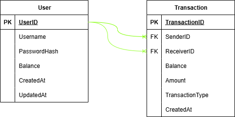

# simple-emoney

Roadmap project structure:

```
simple-emoney/
├── config/
│   └── config.go
├── db/
│   └── migrations/
│       ├── 000001_create_users_table.up.sql
│       ├── 000001_create_users_table.down.sql
│       ├── 000002_create_transactions_table.up.sql
│       └── 000002_create_transactions_table.down.sql
├── internal/
│   ├── app/
│   │   ├── handler/
│   │   │   ├── auth_handler.go
│   │   │   ├── transaction_handler.go
│   │   │   └── user_handler.go
│   │   ├── middleware/
│   │   │   └── auth_middleware.go
│   │   ├── repository/
│   │   │   ├── transaction_repository.go
│   │   │   ├── user_repository.go
│   │   │   └── redis_repository.go
│   │   └── service/
│   │       ├── auth_service.go
│   │       ├── transaction_service.go
│   │       └── user_service.go
│   ├── model/
│   │   ├── auth.go
│   │   ├── transaction.go
│   │   └── user.go
│   └── router/
│       └── router.go
├── pkg/
│   ├── database/
│   │   ├── postgres.go
│   │   └── redis.go
│   └── utils/
│       └── jwt.go
├── .env.example
├── Dockerfile
├── docker-compose.yml
├── go.mod
├── go.sum
├── main.go
└── README.md
```

## Work in Progress!
Masih dalam tahap pengembangan.

## Database Schema


## Cara Menggunakan
> Kamu harus memiliki aplikasi Docker yang sudah ter-install di Sistem Operasi (Operating System) kamu.

Jika kamu belum meng-install aplikasi Docker, kamu bisa download di sini: https://www.docker.com/products/docker-desktop/

Selanjutnya, buka `.env.example`, kemudian copy, dan taruh di file `.env` (jika belum ada, buat `.env` di lokasi yang sama dengan `.env.example`).

Ubah konfigurasi (config) yang ada di `.env` dan sesuai kan dengan keinginan kalian.
> Jika kamu tidak mengubah konfigurasi (config) pada `.env`, maka akan menggunakan konfigurasi (config) secara default.

Jika kamu mengubah konfigurasi pada `.env` maka kamu harus sesuaikan juga konfigurasi tersebut pada `docker-compose.yml`.

## Menjalankan Program
Ketika kamu sudah meng-install Docker, kamu bisa cek apakah aplikasi tersebut sudah bisa dijalankan.

Buka program `Terminal` atau `Command Prompt`. Lalu ketikan `docker`, maka akan menampilkan seperti gambar berikut:


## Wiki
[https://github.com/zuyatna/simple-emoney.wiki.git](https://github.com/zuyatna/simple-emoney/wiki)
